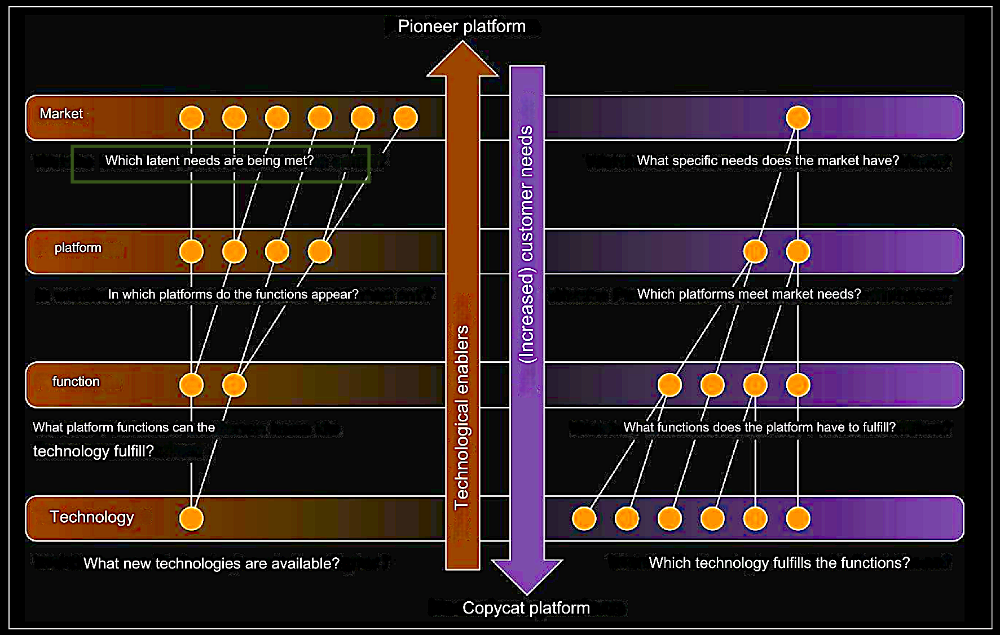

# Latent Space - Latent Capital - Latent Needs?
## Hidden Keys to Strategic Analysis

*Latent* implies the existence of potential or capacity that is not currently manifested but can be realized with the right conditions or strategic actions. My motivation in strategic analysis is to unlock this **Latent Capital** in order to transform unrecognized potential into measurable assets.

While the concept of **Latent Space** in data science refers to a multidimensional space for abstracting data layers, **Latent Needs** are often overlooked. Their importance grows as technology evolves rapidly. Identifying these needs requires deep understanding of market trends and human behaviors. As a professional with exceptional expertise in data science and business management, I excel in anticipating and uncovering latent needs, enabling the development of innovative solutions ahead of the market curve.

--- 

## A Passionate Digital Strategist

My journey in the tech world began early on with learning C from my brother and was further fueled by setting up my first GNU/Linux system. This experience was a cornerstone in developing my passion for data-driven analytics and programming, particularly with PERL, known for its pattern extraction capabilities and Python. My foray into the realms of scientific research collaboration and consulting deepened my appreciation for the integrity and versatility of Computer Algebra Systems (CAS) like Maple and Mathematica. Now, I'm excited to see these principles being integrated into modern platforms like Jupyter, and I'm eager to bring this spirit of visual elegance into future projects.

---

- 📈 I’m currently working on the CFA Institute's certification **Data Science for Investment Professionals** 
  - mathematical models in quantiative finance
  - R and Python in economic modelling and data visualisation
  - agile strategies for data analysis in competitive markets

- 🔭 I’m currently exploring 
  - **Microsoft Azure Appliances**
    - opportunities for automating administration in cloud computing and data management 
  - **Microsoft Semantic Kernel**
    - arming OpenAI's LLM with system calls, external APIs and vector storage  

- 🤝 I’m looking to collaborate on **Integration of OpenAI API functions in the OSX GUI**
  - blending AI with a user-friendly desktop interface.

- 👑 Fun fact: **My first web server was a Siemens Nixdorf Pentium 133, connected from home via a 2x64 kbit/s ISDN uplink**
  - a testament to Linux 2.2.20-xfs, Apache and MySQl

---

  <h3 align="left">⚡ Platforms & Tools</h3>

  <!-- Azure -->
  
 <!-- Docker -->
    
  <!-- Bash -->
  
 <!-- Linux -->
  
  <!-- C -->
  
  <!-- CSS3 -->
  
  <!-- HTML5 -->
  
   <!-- MySQL -->
  
   <!-- R Programming Language -->
    
  <!-- Perl -->
  
  <!-- Python -->
  
  <!-- PyTorch -->
  
  <!-- Wolfram Mathematica -->
  
 

